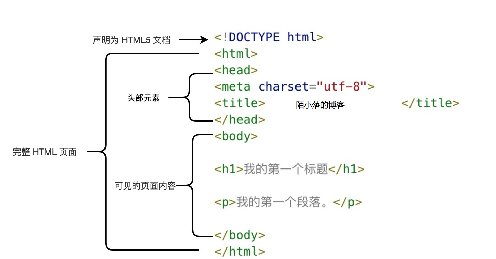

# HTML 标签

## HTML 基本结构



### DOCTYPE 是什么？

DOCTYPE 是一种通用标记语言的文档声明类型，它主要作用是告诉浏览器的解析器，应该以什么样的文档类型定义来解析文档，不同的渲染模式会影响浏览器对 CSS 代码甚至 JavaScript 脚本的解析。它必须声明在文档的第一行。

Document Type Definition，缩写 DTD。 定义了 XML 或 HTML 的特定版本中允许有什么，不允许有什么，在渲染解析页面的时候，浏览器会根据这些规则检查页面的有效性并采取相应的措施。

- HTML5 中没有引入 DTD
- [HTML 4.01 Strict 严格](http://www.w3.org/TR/html4/strict.dtd)
- [HTML 4.01 Transitional 过渡](http://www.w3.org/TR/html4/loose.dtd)
- [Frameset 框架](http://www.w3.org/TR/html4/frameset.dtd)

```
html5
<!DOCTYPE html>

HTML 4.01 Strict 严格
<!DOCTYPE HTML PUBLIC "-//W3C//DTD HTML 4.01//EN" "http://www.w3.org/TR/html4/strict.dtd">

HTML 4.01 Transitional 过渡
<!DOCTYPE HTML PUBLIC "-//W3C//DTD HTML 4.01 Transitional//EN" "http://www.w3.org/TR/html4/loose.dtd">

Frameset 框架
<!DOCTYPE HTML PUBLIC "-//W3C//DTD HTML 4.01 Frameset//EN" "http://www.w3.org/TR/html4/frameset.dtd">
```

### Meta 标签

作用：

- 搜索引擎优化（SEO）
- 定义页面使用语言
- 自动刷新并指向新页面
- 实现网页转化时的动态效果
- 控制页面缓存
- 网页定级评价
- 控制网页显示的窗口等

```
<!DOCTYPE html> <!-- 使用 HTML5 doctype，不区分大小写 -->
<html lang="en"> <!-- 定义页面语言 -->
<head>
    <!-- 声明文档使用的字符编码 -->
    <meta charset='utf-8'>
    <!-- 优先使用 IE 最新版本和 Chrome -->
    <meta http-equiv="X-UA-Compatible" content="IE=edge,chrome=1"/>
    <!-- 页面描述 -->
    <meta name="description" content="不超过150个字符"/>
    <!-- 页面关键词 -->
    <meta name="keywords" content=""/>
    <!-- 网页作者 -->
    <meta name="author" content="name, 771595316@qq.com"/>
    <!-- 搜索引擎抓取 -->
    <meta name="robots" content="index,follow"/>
    <!-- 为移动设备添加 viewport, 并且禁止缩放 -->
    <meta name="viewport" content="initial-scale=1, maximum-scale=3, minimum-scale=1, user-scalable=no">
    <!-- 添加 favicon icon -->
    <link rel="shortcut icon" type="image/ico" href="/favicon.ico"/>
    <!--Web 应用程序清单 -->
    <link rel="manifest" href="/manifest.json">


    <!-- iOS 设备 begin -->
    <!-- 添加到主屏后的标题（iOS 6 新增） -->
    <meta name="apple-mobile-web-app-title" content="标题">
    <!-- 是否启用 WebApp 全屏模式，删除苹果默认的工具栏和菜单栏 -->
    <meta name="apple-mobile-web-app-capable" content="yes"/>
    <!-- 添加智能 App 广告条 Smart App Banner（iOS 6+ Safari） -->
    <meta name="apple-itunes-app" content="app-id=myAppStoreID, affiliate-data=myAffiliateData, app-argument=myURL">
    <!-- 设置苹果工具栏颜色 -->
    <meta name="apple-mobile-web-app-status-bar-style" content="black"/>
    <!-- 忽略页面中的数字识别为电话，忽略email识别,忽略地址识别 -->
    <meta name="format-detection" content="telphone=no, email=no, address=no"/>

    <!-- 启用360浏览器的极速模式(webkit) -->
    <meta name="renderer" content="webkit">
    <!-- 避免IE使用兼容模式 -->
    <meta http-equiv="X-UA-Compatible" content="IE=edge">
    <!-- 不让百度转码 -->
    <meta http-equiv="Cache-Control" content="no-siteapp" />
    <!-- 针对手持设备优化，主要是针对一些老的不识别viewport的浏览器，比如黑莓 -->
    <meta name="HandheldFriendly" content="true">
    <!-- 微软的老式浏览器 -->
    <meta name="MobileOptimized" content="320">
    <!-- uc强制竖屏 -->
    <meta name="screen-orientation" content="portrait">
    <!-- QQ强制竖屏 -->
    <meta name="x5-orientation" content="portrait">
    <!-- UC强制全屏 -->
    <meta name="full-screen" content="yes">
    <!-- QQ强制全屏 -->
    <meta name="x5-fullscreen" content="true">
    <!-- UC应用模式 -->
    <meta name="browsermode" content="application">
    <!-- QQ应用模式 -->
    <meta name="x5-page-mode" content="app">
    <!-- windows phone 点击无高光 -->
    <meta name="msapplication-tap-highlight" content="no">

    <!-- iOS 图标 begin -->
    <!-- iPhone 和 iTouch，默认 57x57 像素，必须有 -->
    <link rel="apple-touch-icon-precomposed" href="/apple-touch-icon-57x57-precomposed.png"/>
    <!-- Retina iPhone 和 Retina iTouch，114x114 像素，可以没有，但推荐有 -->
    <link rel="apple-touch-icon-precomposed" sizes="114x114" href="/apple-touch-icon-114x114-precomposed.png"/>
    <!-- Retina iPad，144x144 像素，可以没有，但推荐有 -->
    <link rel="apple-touch-icon-precomposed" sizes="144x144" href="/apple-touch-icon-144x144-precomposed.png"/>
    <!-- iOS 图标 end -->

    <!-- iOS 启动画面 begin -->
    <link rel="apple-touch-startup-image" sizes="768x1004" href="/splash-screen-768x1004.png"/>
    <!-- iPad 竖屏 768 x 1004（标准分辨率） -->
    <link rel="apple-touch-startup-image" sizes="1536x2008" href="/splash-screen-1536x2008.png"/>
    <!-- iPad 竖屏 1536x2008（Retina） -->
    <link rel="apple-touch-startup-image" sizes="1024x748" href="/Default-Portrait-1024x748.png"/>
    <!-- iPad 横屏 1024x748（标准分辨率） -->
    <link rel="apple-touch-startup-image" sizes="2048x1496" href="/splash-screen-2048x1496.png"/>
    <!-- iPad 横屏 2048x1496（Retina） -->
    <link rel="apple-touch-startup-image" href="/splash-screen-320x480.png"/>
    <!-- iPhone/iPod Touch 竖屏 320x480 (标准分辨率) -->
    <link rel="apple-touch-startup-image" sizes="640x960" href="/splash-screen-640x960.png"/>
    <!-- iPhone/iPod Touch 竖屏 640x960 (Retina) -->
    <link rel="apple-touch-startup-image" sizes="640x1136" href="/splash-screen-640x1136.png"/>
    <!-- iPhone 5/iPod Touch 5 竖屏 640x1136 (Retina) -->
    <!-- iOS 启动画面 end -->
    <!-- iOS 设备 end -->

    <!-- Windows 8 磁贴颜色 -->
    <meta name="msapplication-TileColor" content="#000"/>
    <!-- Windows 8 磁贴图标 -->
    <meta name="msapplication-TileImage" content="icon.png"/>

    <!-- 添加 RSS 订阅 -->
    <link rel="alternate" type="application/rss+xml" title="RSS" href="/rss.xml"/>

    <!-- Open Graph protocol(https://ogp.me/) begin -->
    <meta property="og:type" content="类型" />
    <meta property="og:url" content="URL地址" />
    <meta property="og:title" content="标题" />
    <meta property="og:image" content="图片" />
    <meta property="og:description" content="描述" />
    <!-- sns 社交标签 end -->

    <title>标题</title>
</head>
```

### html 语义化

- 对开发者友好，让人更容易读懂，利于代码可读性。
- 对机器友好，让搜索引擎更容易读懂，利于 seo。

### 渐进增强和优雅降级的区别

- 渐进增强是针对低版本浏览器也能保证基础功能，然后对高级浏览器改进追加功能；
- 优雅降级是一开始构建完整功能，再对低版本进行兼容
